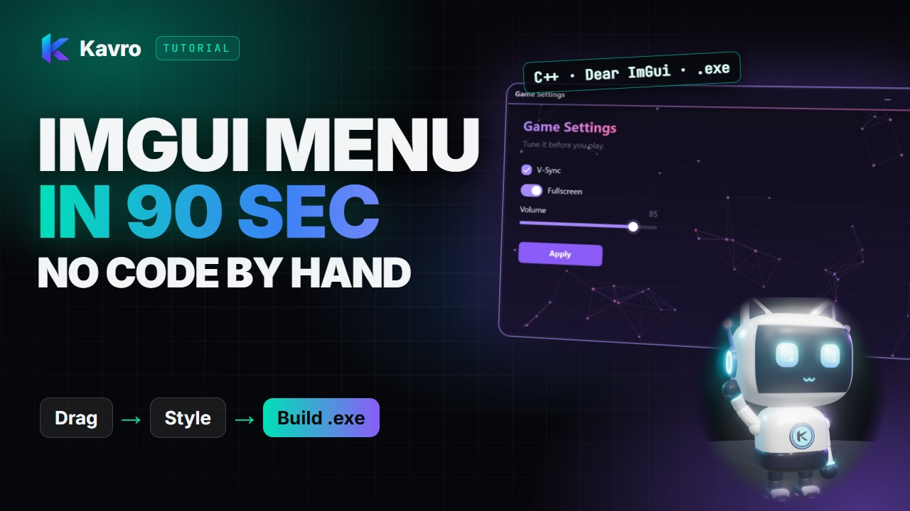
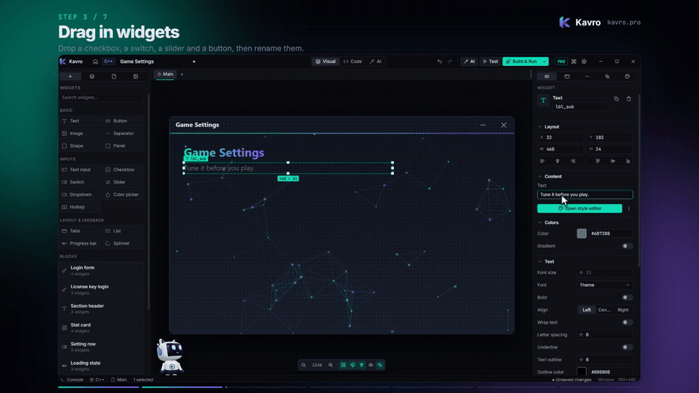
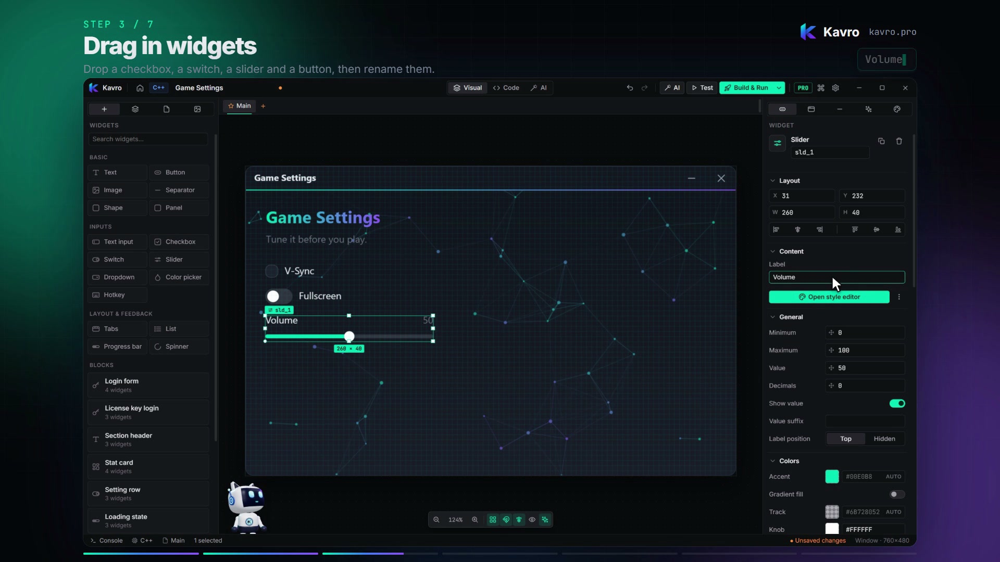
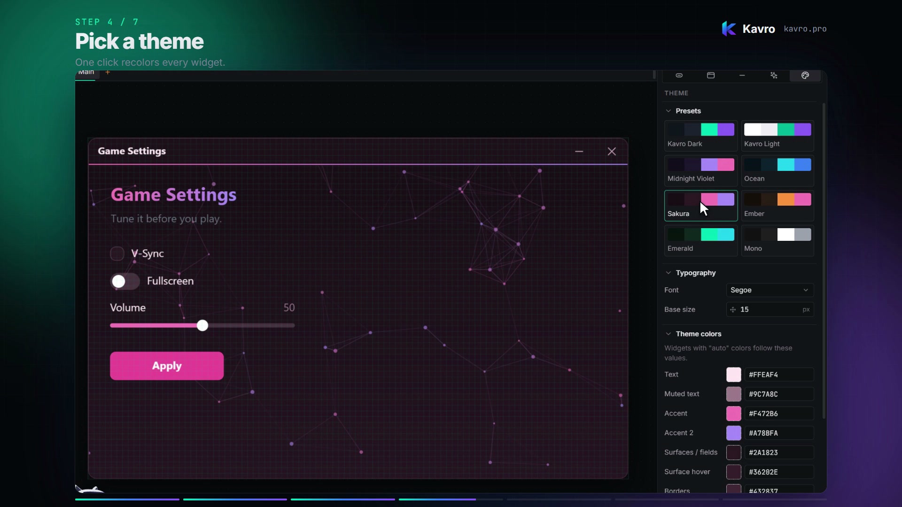
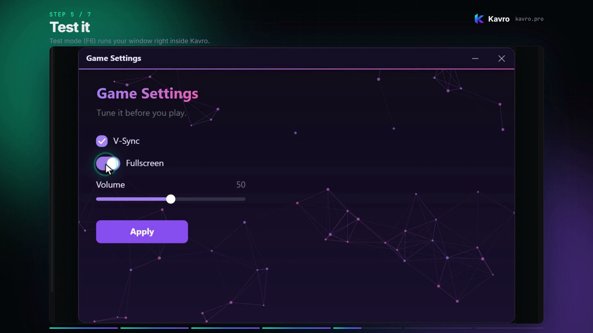
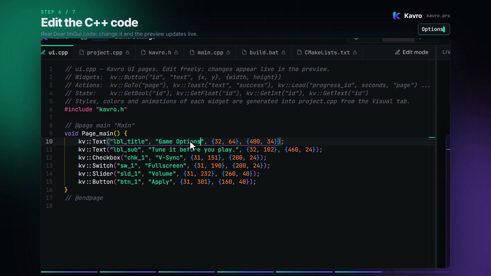
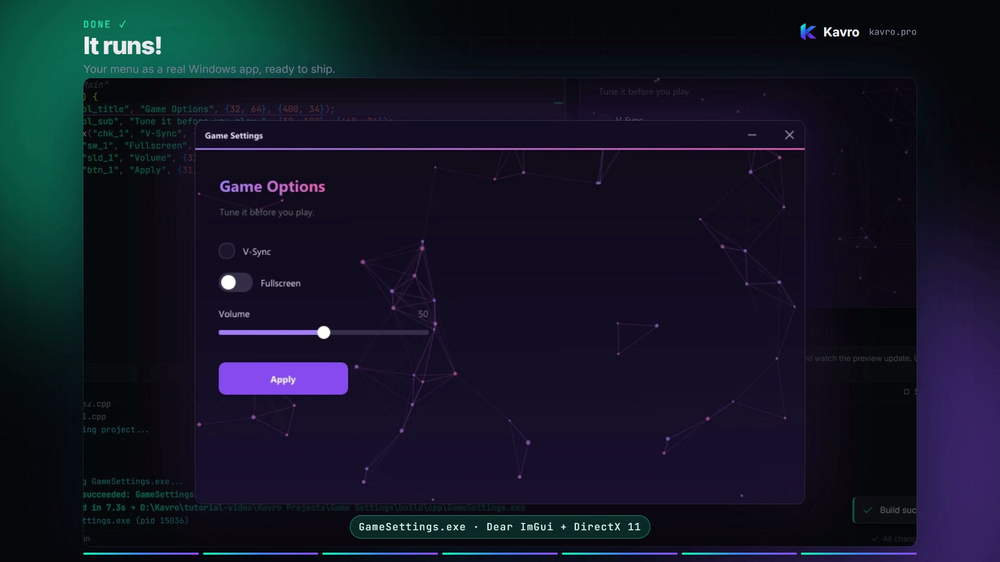

<div align="center">



# Kavro

**A visual designer for Dear ImGui.**
Drag widgets onto a canvas, style them, test the window, then export real **C++, C# or Rust** and build a native `.exe`.

[](https://kavro.pro)
[](https://discord.gg/GeFa4vdTD)
[](https://www.youtube.com/@kavropro)


</div>

---

<p align="center"></p>

## Why Kavro?

Building Dear ImGui menus by hand means guessing `SetCursorPos` values, recompiling to see whether a button moved four pixels, and copying the same styling code between projects. Kavro gives you a canvas instead:

- **Drag & drop.** 17 widgets: text, buttons, checkboxes, switches, sliders, dropdowns, color pickers, hotkeys, tabs, lists, progress bars, spinners and more. Plus ready-made blocks (login form, sidebar, stat card…).
- **Style without code.** Theme presets (Kavro Dark, Midnight Violet, Ocean, Sakura, Ember…), per-widget colors, fonts, rounding, and 13 animated backgrounds.
- **Test it right away.** Test mode (**F6**) runs your window inside the editor: click, type, drag sliders.
- **Real code, both ways.** The code view and the canvas stay in sync. Edit the code and the canvas updates, or the other way round.
- **One key to a running app.** **F5** compiles a native Windows `.exe` in seconds.

## From canvas to code

What you build on the canvas is plain, readable code: one call per widget, on top of a small runtime header (`kavro.h`):

```cpp
#include "kavro.h"

// @page main "Main"
void Page_main() {
    kv::Text("lbl_title", "Game Settings", {32, 64}, {400, 34});
    kv::Text("lbl_sub", "Tune it before you play.", {32, 102}, {460, 24});
    kv::Checkbox("chk_1", "V-Sync", {31, 151}, {200, 24});
    kv::Switch("sw_1", "Fullscreen", {31, 190}, {200, 24});
    kv::Slider("sld_1", "Volume", {31, 232}, {260, 40});
    kv::Button("btn_1", "Apply", {31, 301}, {160, 40});
}
// @endpage
```

Read values from your own code with `kv::GetBool("chk_1")`, `kv::GetFloat("sld_1")`, `kv::GetText(...)`, and trigger actions like `kv::GoTo("page")` or `kv::Toast("Saved", "success")`. Code Kavro doesn't recognize is kept as your custom code.

| Language | Stack | Builds with |
|---|---|---|
| **C++** | Dear ImGui + DirectX 11 | MSVC (Visual Studio) |
| **Rust** | imgui-rs + glium | Cargo |
| **C#** | ImGui.NET + Silk.NET | .NET 8 |

## Screenshots

| Drag in widgets | Pick a theme |
|---|---|
|  |  |
| **Test it (F6)** | **Edit the code, live preview** |
|  |  |

<p align="center"><b>Build & Run (F5): a real Windows app</b><br></p>

## Get started

1. **Download** Kavro from **[kavro.pro](https://kavro.pro)** (free account).
2. **New project →** Window or Loader → pick a language and a template.
3. **Drag widgets** from the left panel, edit them in the inspector on the right.
4. **F6** to test, **F5** to build and run.

Watch the 2-minute tutorial on **[YouTube](https://www.youtube.com/@kavropro)**.

### Requirements
- Windows 10 or 11 (64-bit)
- To build: **Visual Studio** with the C++ workload (C++), **Rust/Cargo** (Rust) or the **.NET 8 SDK** (C#). Kavro finds them automatically; paths can be set in Settings → Build.

### Handy shortcuts
| Key | What it does |
|---|---|
| **F5** | Build & Run |
| **F6** | Test mode |
| **Ctrl+K** | Command palette |
| **Ctrl+E** | Style editor for the selected widget |
| **Ctrl+D** | Duplicate the selection |
| **Ctrl+I** | AI assistant |
| **Ctrl+Z / Ctrl+Y** | Undo / redo |

## Free and Pro

| | Free | Pro |
|---|:---:|:---:|
| Visual editor, inspector, style editor | ✅ | ✅ |
| Test mode | ✅ | ✅ |
| Widgets | 15 | All 17 |
| Pages | Up to 2 | Unlimited |
| Templates & animated backgrounds | A few | All |
| Build & Run (.exe), source export | — | ✅ |
| C#, Rust, two-way code sync | — | ✅ |
| Kavro AI tab | — | ✅ |
| Commercial use | — | ✅ |

**Pro:** $10/month, or $108/year (10% off). Cancel any time. → **[kavro.pro/#pricing](https://kavro.pro/#pricing)**

## Help & feedback

- 💬 **[Discord](https://discord.gg/GeFa4vdTD)**: questions, showcase, update news
- 🐞 **[Issues](../../issues)**: bug reports and feature requests (please add your Kavro version and steps to reproduce)
- 📖 **[Docs](https://kavro.pro/docs)**
- ✉️ support@kavro.pro

If you build something with Kavro, share it in the Discord showcase. We'd love to see it.

---

<sub>Kavro is closed-source software. This repository hosts the project page, release notes and the issue tracker. Dear ImGui is © Omar Cornut and contributors (MIT); Kavro is an independent project and not affiliated with Dear ImGui.</sub>
